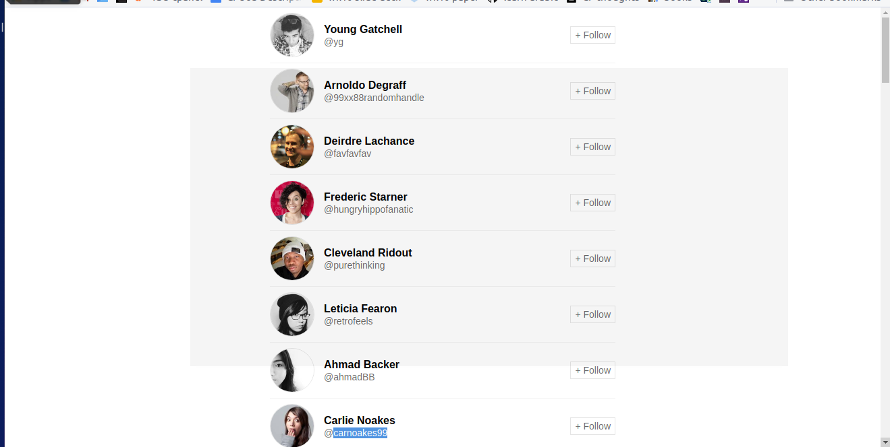

# React + Sass
If you're not sure what any of the above things are, google them.

## SASS

Credit to https://zellwk.com/blog/css-architecture-3/ for parts of the SASS file structure and various CSS resets.

## How to run this app
### Dev
1. Clone this repo
1. run `npm install`
1. run `npm run dev:build`
  - this bundles and watches the react app
1. in another terminal tab, run `npm run dev:start`
  - this runs and watches the server

## Exercise

Edit markup and styles so that list renders like

(ignore the grey rectangle)
